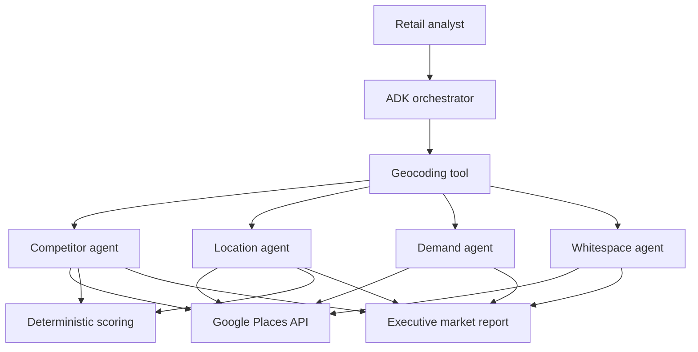

# Retail Market Intelligence Agent

[](https://www.python.org/)
[](https://google.github.io/adk-docs/)
[](LICENSE)

A portfolio-ready multi-agent application that evaluates retail expansion
opportunities using Gemini, Google Agent Development Kit (ADK), and Google
Places data. The system converts a store concept and target address into an
evidence-grounded market report covering competitors, site quality, demand,
traffic proxies, market gaps, risks, and recommended next actions.

## Business problem

Retail expansion teams often assemble market intelligence manually across
maps, reviews, nearby businesses, transit access, and demographic proxies.
This project coordinates specialized AI agents and deterministic scoring
functions to produce a consistent first-pass site assessment in minutes.

## Capabilities

- Geocodes a proposed store address and defines the analysis radius.
- Runs four specialist agents for competitor, location, demand, and whitespace
  analysis.
- Uses Google Places API v1 for live business and location evidence.
- Calculates reproducible competitor and site scores outside the LLM.
- Produces a structured executive report with assumptions and confidence.
- Supports Google AI Studio for local development and Vertex AI for enterprise
  deployment.
- Includes unit tests, linting, secret-safe configuration, and GitHub Actions.

## Architecture



## Agent responsibilities

| Agent | Responsibility | Primary output |
|---|---|---|
| Competitor Intelligence | Finds nearby retailers and measures competitive pressure | Ranked competitors and threat scores |
| Location Viability | Evaluates access, anchors, saturation, and demand proxies | Site score from 0 to 100 |
| Demand Signals | Examines ratings, review volume, anchors, and operating patterns | Demand level, confidence, and peak-period proxies |
| Whitespace Discovery | Searches adjacent retail concepts and unmet customer needs | Ranked market-gap opportunities |
| Orchestrator | Coordinates tools and agents and reconciles their evidence | Executive recommendation with risks |

## Quick start

### Prerequisites

- Python 3.11 or newer
- [`uv`](https://docs.astral.sh/uv/)
- A Google AI Studio API key, or a Google Cloud project with Vertex AI enabled
- A Google Places API key with Places API (New) and Geocoding API enabled

### Install and configure

```bash
git clone https://github.com/ashokchinthak6/retail-market-intelligence-agent.git
cd retail-market-intelligence-agent
uv sync
cp .env.example .env
```

Add your own keys to `.env`. Never commit that file.

### Run locally

```bash
uv run adk web
```

Select `app` in the ADK interface and try:

```text
Evaluate opening an off-price apparel store near 4400 Sharon Road,
Charlotte, NC. Use a 2,000-meter radius and focus on value-conscious shoppers.
```

You can also use the terminal:

```bash
uv run adk run app
```

## Example output

The generated report contains:

1. Executive recommendation and confidence
2. Top competitors with transparent threat scores
3. Location viability score and component breakdown
4. Demand and traffic proxies
5. Customer and assortment whitespace
6. Risks, assumptions, and recommended validation steps

The analysis is decision support, not a replacement for lease, demographic,
financial, legal, or professional site-selection due diligence.

## Quality checks

```bash
uv run ruff check .
uv run pytest
```

Tests cover distance calculation, competitor scoring, site-score weighting,
input validation, and safe normalization of Places API responses.

## Deployment direction

For an enterprise implementation, configure Vertex AI authentication and
deploy through ADK Agent Engine or Cloud Run. Add persistent session storage,
OpenTelemetry traces, evaluation datasets, rate limits, and organizational
guardrails before production use.

## Security

- Credentials are read only from environment variables.
- `.env` and common secret-bearing files are excluded from source control.
- API errors are normalized before they reach the agent.
- No customer, payment, or personally identifiable data is required.

## Attribution

This project is a retail-focused adaptation of Google's Apache-2.0 licensed
[Market Research Agent](https://github.com/google/adk-samples/tree/main/contrib/python/market-research-agent).
See [NOTICE](NOTICE) for attribution and a summary of modifications.

## Author

Customized and extended by [Ashok Chinthakindi](https://github.com/ashokchinthak6).

